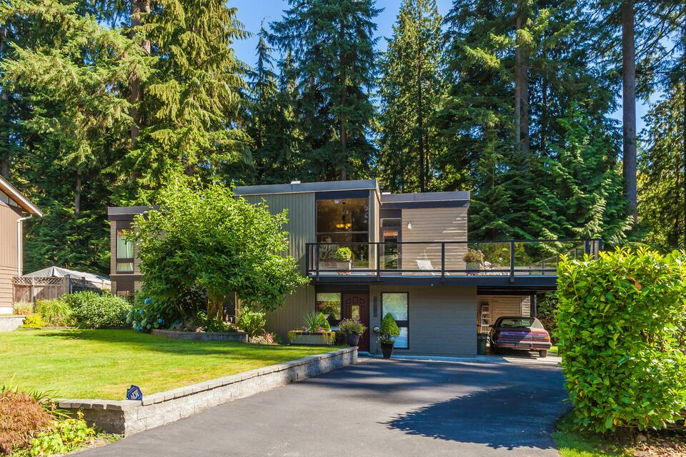
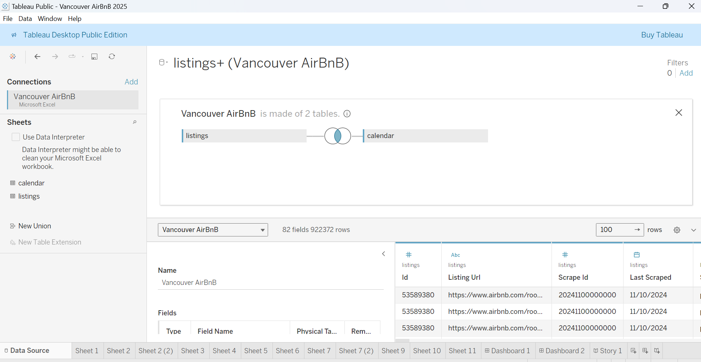
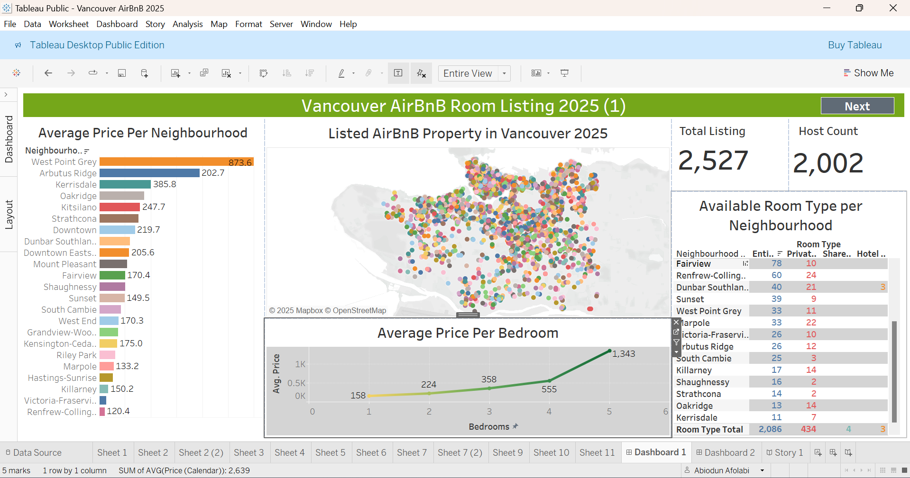
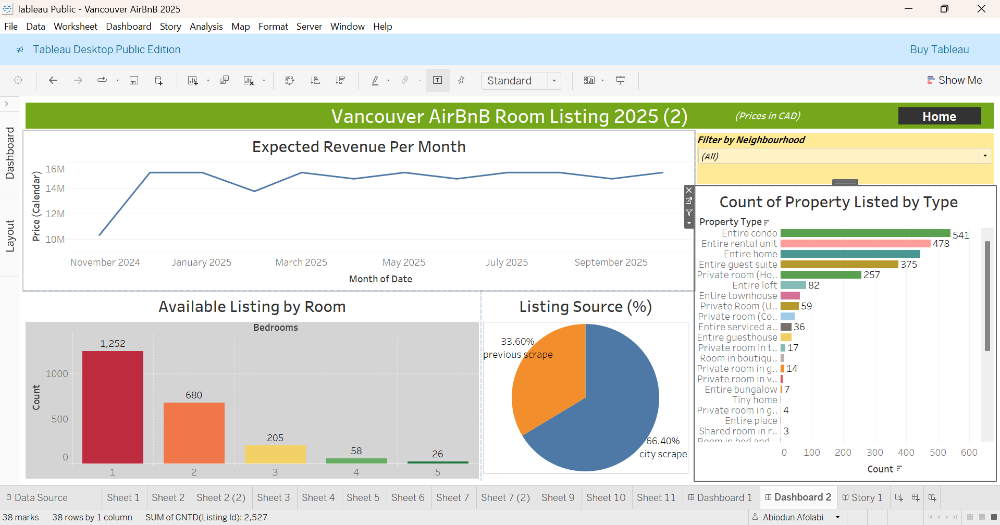

# Airbnb Price Analysis in Vancouver (2025) 

## Overview 

This documentation presents an analysis of the Airbnb listings in Vancouver for the year 2025, utilizing Tableau for data visualization and a dataset from Airbnb. It highlights expected revenue, pricing per neighborhood, room availability, and overall trends that could inform stakeholders and guests about the rental market dynamics in the area.

## Problem Statement 

With the increasing demand for short-term rentals, Vancouver's Airbnb market is growing significantly. Investors, policymakers, and stakeholders require a data-driven understanding of the pricing trends, listing distribution, and revenue potential to make informed decisions. 

The main objectives of this project are:
1.	Identify the distribution of Airbnb listings across Vancouver's neighborhoods.
2.	Analyze the pricing structure based on room type, neighborhood, and number of bedrooms.
3.	Provide insights into revenue trends and expected monthly earnings for 2025.
4.	Assist stakeholders in optimizing their investment strategies based on market trends.

## Modelling

Automatically derived relationships are adjusted between calendar and listings table to inner join on the id column.

## Methodology

### Data Collection:

-	Data was sourced from [InsideAirbnb](https://insideairbnb.com/vancouver/), a trusted resource for Airbnb listing data.
-	The dataset includes 2 tables with details on listing prices, property types, host counts, and geographical distribution.

### Data Processing & Cleaning:
-	Missing values and inconsistencies were identified and handled appropriately on Microsoft Excel Power Query Editor.
-	Data was categorized based on neighborhoods, room types, and pricing.
-	Pricing outliers were detected and adjusted to avoid skewed analysis.

## Data Visualization using Tableau

**Dashboard 1**

Total Listings and Host Count 
-	In total, there are 2,527 listed properties with 2,002 active hosts, indicating a healthy host participation rate in the Vancouver Airbnb market. 

Price Variation by Neighborhood 
-	Significant price disparities are noted across neighborhoods; West Point Grey leads with an average price of 873.6 CAD, while Renfrew-Collingwood is the least expensive at 120.4 CAD. 
-	The average prices per neighborhood are visually represented in the first dashboard, demonstrating clear spatial distribution of pricing trends. 

Average Price per Bedroom 
-	The average price for renting a bedroom shows a progressive increase as the number of bedrooms rises. 
-	For instance, the average cost for a one-bedroom is 158 CAD, climbing to 1,343 CAD for a five-bedroom unit, indicating luxury demand for larger accommodations. 

Room Type Distribution 
-	The analysis reveals that entire condos are the most frequently listed room type with 541 listings, followed closely by entire rental units at 478. 
-	Entire cabin and boat account for a smaller portion of total listings. 

**Dashboard 2**

Expected Revenue per Month 
-	The projected revenue for the Vancouver Airbnb market exhibits a gradual increase, peaking around 15 million CAD per month from November 2024 through September 2025. 
-	The graph illustrates a steady trend with slight fluctuations, signifying a robust market outlook. 

Available Listings by Room and Source
-	A majority of listings are for one-bedroom units, totaling 1,252 available listings, indicating a preference for smaller accommodations. 
-	As the number of bedrooms increases, the available listings drop significantly, with only 58 available for four bedrooms and 26 for five bedrooms. 
- There are two listing source available in Vancouve, City scrape is the leading listing source taking 66.4% while the Previous scrape took 33.6% of the overall source.

**_You can interact with the report_** [here]()

## Insights for Stakeholders and Investors:

Most Expensive Neighborhoods:
-	West Point Grey has the highest average price at $873.6 per night, indicating a high-end market.
-	Other premium areas include Kerrisdale ($385.8) and Oakridge ($247.7), presenting lucrative investment opportunities.

Most Popular Property Types:
-	Entire condos (541 listings) and entire rental units (444 listings) dominate the market, reflecting higher demand for privacy.
-	Guest suites (375 listings) and private rooms (257 listings) are also viable options for budget travelers.

Revenue Potential:
-	Expected monthly revenue follows a seasonal pattern, with peaks observed around the holiday seasons.
-	Investors should optimize pricing strategies to maximize earnings during high-demand months.

Listing Growth and Market Share:
-	66.4% of listings are from city-scraped data, indicating a growing market.
-	New hosts entering the market should analyze competitive pricing trends to establish competitive listings.

## Conclusion 

This analysis provides valuable insights into the Airbnb market in Vancouver for the year 2025. The data indicates a flourishing rental market, with significant price variations across different neighborhoods and a strong demand for various types of room rentals. Stakeholders, including potential hosts and guests, can leverage this information for pricing strategies and booking decisions. 

## Recommendations 

-	For Guests: Explore neighborhoods based on pricing criteria to make informed choices that fit budget and accommodation preferences. 
-	For Investors: Focus on high-demand neighborhoods like Downtown, West Point Grey, and Kitsilano for premium listings.
-	For Policymakers: The rising number of short-term rentals may impact long-term housing availability. Consider regulations balancing tourism with residential needs.
-	For Hosts: Competitive pricing and strategic property type selection (entire condos and homes) can enhance profitability.

